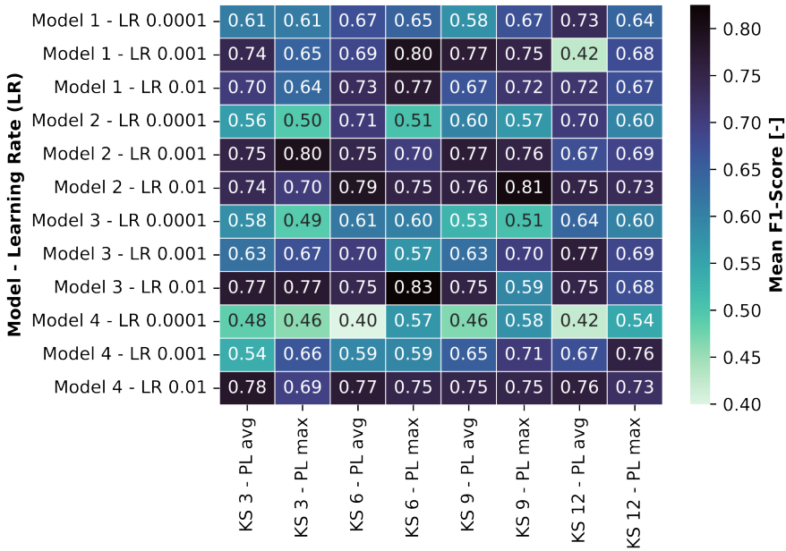

# Research Project: Detecting Atrial Fibrillation Patients during Sinus Rhythm using Deep Learning

This repository contains the code used in a research project during my master's program.

## Abstract

Atrial Fibrillation (AF) is one of the most common arrhythmias that can lead to a stroke and heart failure when untreated.
Therefore, automatically detecting AF in its early paroxysmal stages can initiate medical treatment to prevent AF to progress in its more frequent stages.
A deep learning approach was applied to detect AF in Sinus Rhythm (SR) Electrocardiograms (ECGs) and was trained with the Computers in Cardiology Challenge 2001 (CinC 2001) dataset [CinC2001].
To lower the influence of the size of the dataset, a transfer learning approach was investigated by pretraining the deep learning model with the PhysioNet/Computing in Cardiology Challenge 2021 (CinC 2021) dataset [CinC2021] to estimate a subject’s age from SR ECGs.
The pretrained model for age estimation produced a Mean Absolute Error (MAE) of 11.50 years on a separate test data split.
The model trained without transfer learning achieved an accuracy of 53.00 % and the model trained with transfer learning achieved an accuracy of 53.52 % on a separate test data slit.
In a further experiment including less recordings per subject in the training data set the model produced an accuracy of 62.07 %.
The results from the age estimation model showed that the chosen deep learning approach is able to learn subtle featuresfrom SR ECGs recordings.
However, the models could not reliably distinguish between AF and non-AF SR ECGs.
The size of the CinC 2001 dataset was identified as the main limitation of the approach.

## Concept

The CinC 2001 dataset consists of 50 ECG recordings which have a duration of 30 minutes.
Each recording contains two unknown leads.
For the model's training process, the recordings were split up into 10 second segments with the aim to lower the models complexity and to increase the dataset's size.
Furthermore the ECG signals were preprocessed to remove outliers and segments with signal clipping.
Finally, a Butterworth [butterworth] bandpass filter was applied to eliminate noise.

The datasets PTB-XL [PTB-XL], Chapman-Shaoxing [Chapman-Shaoxing] and Ningbo [Ningbo] were used from the CinC 2021 dataset.
The recordings were preprocessed with the same methods the CinC 2001 dataset was preprocessed.
Furthermore, two leads per 10 second recording were chosen ranomly to match the structure of the CinC 2001 ECG recordings.

||
|:--:|
|Conceptual steps conducted in the project.|

The model's training was done in three steps:

**1. Step:**
A Convolutional Neural Network (CNN) was trained on the CinC 2001 dataset to distinguish between ECGs from patients with and without AF.
The model's hyperparameters were determined in a grid search.
The best performing model was saved.

**2. Step:**
The best performing model from the previous step was now trained on the CinC 2021 dataset with the aim to estimate a patients age from an ECG recording.
The best performing model was saved.

**3. Step:**
The layers of the model saved in the previous step were now frozen.
One by one, the layers were made trainable and the model was re-trianed with the CinC 2001 dataset with the original goal to distinguish between patients with and without AF.

The best performing models found in step one and step three were then compared to investigate the influence of transfer learning.

<!-- TODO maybe the figure of the final ECG? -->
<!-- also CNN model? -->

## Results

### Without Transfer Learning

<table>
  <tr>
    <td>
      

        
      

    </td>
    <td>
      

        
      

    </td>
  </tr>
  <tr>
    <td colspan="2">
      
Results of the grid search measured in mean accuracy (left) and mean F1-score (right). The horizontal axis shows the tested kernel sizes (KS) in the convolutional layers in the first block of each individual path of the network as well as the different tested types of pooling layers (PL). The vertical axis shows the tested model architectures as well as the tested learning rates (LR). Each cell represents one combination of tested hyperparameters. The value of a cell was calculated from a five-fold cross validation. The values are scaled to the range between zero and one.

    </td>
  </tr>
</table>

The combination of model architecture three, learning rate 0.01, kernel size six and pooling layer max-pooling resulted in the highest value and therefore best performance across all metrics.
The models with this combination resulting from the five-fold cross validation were evaluated as an ensemble of models on a test data split.
The classification of the ensemble for a single recording was evaluated as a vote from the classifications of the five models.
The ensemble produced an accuracy of 53.00 % and an F1-score of 68.20 % on the test data split.

### Regression

||
|:--:|
|Individual age predictions of the final regression model for the recordings in the test data split after recordings labeled with the age of zero were removed from the training and test data split. A linear regression was fitted on the predictions and shown as red line. Optimal predictions would lie on a line with a slope of one (dashed black line). The model was trained for 132 epochs and resulted in a mean absolute error (MAE) of 11.5 years on the test data split.|

### With Transfer Learning

<table>
  <tr>
    <td>
      

        
      

    </td>
    <td>
      

        
      

    </td>
  </tr>
  <tr>
    <td colspan="2">
      
Results of the final transfer learning step measured in mean accuracy (left) and mean F1-score (right). The horizontal axis shows the tested number of layers that were retrained for the main classification problem. The vertical axis shows the tested learning rates. Each cell represents one combination of tested learning rate and number of retrained layers. The value of a cell was calculated from a five-fold cross validation. The values are scaled to the range between zero and one.

    </td>
  </tr>
</table>

The model condidered to be best performing was the model retraind in six layers with a learning rate of 0.01.
The models with this combination resulting from a five-fold cross validation were again evaluated as a ensemble ob models on a test data split.
The ensemble produced an accuracy of 53.52 % and an F1-score of 68.05 % on the test data split.

## Discussion

Both networks, with and without transfer learning, failed to reliably distinguish between patients with and without AF on the test data split.
The results of the regression problem, however, suggest that the chosen model architecture is able to find to subtle patterns in ECG recordings.
The main challenge in this project compared to publications with the same goal was the small size of the dataset in terms of different patients.
Furthermore, the number of ECG recordings per subject were high compared to other publicaitons.
This could lead the network to learn subject specifc features in the data instead of AF specifc features.
Further studies were conducted by including a fewer number of ECG recordings per subject.
This approach did not lead to a better classification performance.

## Bibliography 

- [CinC2001] George Moody et al. “Predicting the onset of paroxysmal atrial fibrillation: The Computers in Cardiology Challenge 2001”. In: Computers in Cardiology 2001. Vol. 28 (Cat. No. 01CH37287). IEEE. 2001, pp. 113–116.
- [CinC2021] Matthew A Reyna et al. “Will two do? Varying dimensions in electrocardiography: the PhysioNet/Computing in Cardiology Challenge 2021”. In: 2021 Computing in Cardiology (CinC). Vol. 48. IEEE. 2021, pp. 1–4.
- [butterworth] Stephen Butterworth et al. “On the theory of filter amplifiers”. In: Wireless Engineer 7.6 (1930), pp. 536–541.

## Appendix

||
|:--:|
|Visualization of one out of four architectures of a model used in a grid search. The shown architecture is referred to as model four and was the smallest tested model in terms of trainable parameters. The model consists of two identical paths. Each path is built from two blocks of layers with an identical order of layers. The blocks contain one convolutional layer, one batch normalization layes, one pooling layer and one dropout layer. After the last block, each path contains a global average pooling layer that transforms the shape of the output of its previous layer so that it is processable by a dense layer. Two dense layers are applied at the end of each path where the last layer produces a single value as output for its individual path. The outputs of both paths are concatenated to a common dense layer that produces the output of the network. Parameters kernel size (KS) of the convolutional layers in the first block of each path and type of pooling operation in all pooling layers are assigned multiple options which were tested in the grid search. KS: kernel size, OS: output size, ReLU: Rectified Linear Unit|
